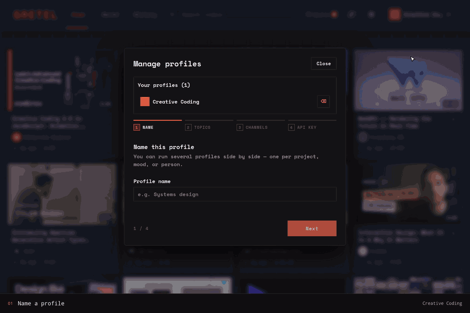

```text
  _____ _____  ______ _______ ______ _      
 / ____|  __ \|  ____|__   __|  ____| |     
| |  __| |__) | |__     | |  | |__  | |     
| | |_ |  _  /|  __|    | |  |  __| | |     
| |__| | | \ \| |____   | |  | |____| |____ 
 \_____|_|  \_\______|  |_|  |______|______|
```

# Gretel

Gretel is a desktop app for building a more intentional YouTube feed. Create profiles, add topics and channels you care about, and let Gretel build a personalized feed using YouTube data and OpenRouter embeddings.

> Current status: **public beta**. Expect rough edges, unsigned installers, and possible platform-specific bugs. Please report problems through [GitHub Issues](https://github.com/Relic-a/Gretel/issues).

## Showcase

From an empty install: create a profile, seed it with topics and channels, watch Gretel build and rank the feed, then save, queue and organise what you find.

[](docs/showcase/gretel-showcase.mp4)


Watch the 57-second tour [with narration](docs/showcase/gretel-showcase-narrated.mp4) or [without audio](docs/showcase/gretel-showcase.mp4), both at 2880×1920 and 60 fps. The inline GIF is a silent preview. See [`showcase/`](showcase/) for how it is recorded and rendered.

### Every step

A short silent GIF of the full tour, one loop per step, cut from the video
[without narration](docs/showcase/gretel-showcase.mp4):



Prefer one step at a time? Each interaction also has its own clip:

| Step | Step |
| --- | --- |
| **1 · Name a profile**<br>Creative Coding<br> | **2 · Add topics**<br>Web design · Generative art · WebGL<br> |
| **3 · Add a channel**<br>The Coding Train<br> | **4 · Browse the feed**<br>Save for later or add to the queue<br> |
| **5 · Watch a video**<br>Player, details, and up next<br> | **6 · Change the queue order**<br>Choose what plays next<br> |
| **7 · Organize saved videos**<br>Keep related videos in a collection<br> | |

## Install the beta

Download the newest beta installer for your platform from [Gretel Releases](https://github.com/Relic-a/Gretel/releases):

- Windows: `.exe`
- macOS (Apple silicon): `.dmg`
- Linux: `.deb`, `.rpm`, `.AppImage`, or Arch package

The installers are currently unsigned, so your operating system may show an unfamiliar-developer warning. Gretel installs signed in-app updates on Windows, macOS, AppImage, `.deb`, and `.rpm` installations. Arch packages link to the matching release and update through `pacman`.

## Features

- Personalized YouTube feed by profile
- Topic and channel based discovery
- Saved videos, liked videos, and watch history
- Local SQLite storage
- OpenRouter-powered embeddings
- Desktop builds for Linux, Windows, and macOS through Tauri

## Requirements

- Node.js 24.x
- npm
- Rust 1.77+ and the platform prerequisites listed by Tauri (Windows builds need Visual Studio Build Tools with the MSVC and Windows SDK workloads)
- An OpenRouter API key

You can create an OpenRouter key at:

https://openrouter.ai/keys

## Development Setup

Clone the repo and install dependencies:

```bash
git clone https://github.com/Relic-a/gretel.git
cd gretel
npm install
```

Create a local environment file:

```bash
cp .env.example .env
```

Then add your OpenRouter API key:

```env
OPENROUTER_API_KEY=your_openrouter_key_here
OPENROUTER_SITE_URL=http://localhost:3000
OPENROUTER_APP_NAME=Gretel
```

`OPENROUTER_KEY` is also accepted as an API-key environment variable.

Run the web app only:

```bash
npm run dev
```

Run the Tauri desktop app in development:

```bash
npm run tauri:dev
```

## App Settings

You can also enter your OpenRouter API key inside the app settings UI. Gretel stores local settings in the app data directory, not in the public repo.

The key is stored locally as plain text so the bundled server can use it. On macOS and Linux, Gretel restricts the settings file to the current OS user. Use a dedicated OpenRouter key with a spending limit and revoke it if the device is lost or shared. See [Privacy](PRIVACY.md) for the complete data flow.

Approximate data locations:

- Linux: `~/.local/share/com.ezana.gretel/data`
- Windows: `%APPDATA%/com.ezana.gretel/data`
- macOS: `~/Library/Application Support/com.ezana.gretel/data`

Existing Electron data in the previous `Gretel/data` location is reused automatically when the new Tauri data directory is empty.

### Linux rendering compatibility

Gretel leaves WebKitGTK's renderer defaults unchanged. If an NVIDIA system running Wayland crashes in `libnvidia-gpucomp` or `libEGL_nvidia`, launch Gretel with the narrow explicit-sync workaround first:

```bash
GRETEL_RENDER_MODE=nvidia-wayland gretel
```

This mode sets `__NV_DISABLE_EXPLICIT_SYNC=1` only when Gretel detects both Wayland and an NVIDIA GPU. If the problem continues, use the stronger and potentially slower DMA-BUF fallback:

```bash
GRETEL_RENDER_MODE=disable-dmabuf gretel
```

The fallback sets `WEBKIT_DISABLE_DMABUF_RENDERER=1`. On Linux, startup logs include the display protocol, detected GPU vendors, discoverable WebKitGTK version, requested mode, and selected mode. Unset `GRETEL_RENDER_MODE` (or set it to `default`) to use normal rendering.

## Build Locally

Tauri bundles the Next.js standalone server and a matching Node.js runtime, so installed desktop builds do not require Node.js on the end user's machine. Rust (with the platform's Tauri prerequisites) and Node.js are required when building from source.

Build each package on its target OS and architecture; the preparation step intentionally rejects cross-target builds because it embeds the host Node.js runtime.

Build Linux packages:

```bash
npm run dist:linux
```

Build Windows packages:

```bash
npm run dist:win
```

Build macOS packages:

```bash
npm run dist:mac
```

Notes:

- Linux release builds compile once and produce verified `.deb`, `.rpm`, and AppImage artifacts; the Arch package is then derived from that exact `.deb` artifact. Publication is blocked unless every supported platform package is present. The native packages declare the GStreamer demuxer and software-decoder plugins needed by WebKitGTK; the AppImage bundles its media framework.
- Linux source/development environments must provide WebKitGTK plus GStreamer's base, good, bad, and libav plugin sets. The package names vary by distribution.
- Windows builds produce `.exe` installers. Prerelease builds use Tauri's NSIS target because MSI only accepts numeric prerelease identifiers.
- macOS builds require macOS for best results.
- Local builds are unsigned by default.

## Performance Diagnostics

Performance analytics are off by default. Enable **Developer analytics** in Settings, then open `/diagnostics` (or use the activity icon in the app header) to inspect locally persisted performance telemetry. When enabled, Gretel records initial feed builds, load-more and exhaustion expansions, preemptive expansions, profile creation, and comment fetching. The dashboard reports run counts, errors, total measured time, p50/p95/p99 latency, and operation-level hotspots.

Metrics are stored in `data/gretel.sqlite` and retained for 30 days by default. Set `GRETEL_METRICS_RETENTION_DAYS` to change the retention window. A machine-readable report is available at `/api/performance?hours=168`; optional `workflow` and `profileId` parameters narrow it.

Operation percentages are hotspot indicators. Some operations are nested or concurrent, so they do not necessarily add to 100%.

## Project Scripts

```bash
npm run dev            # Start Next.js dev server
npm run tauri:dev      # Start Next.js and Tauri together
npm run build          # Build Next.js
npm run tauri:build    # Build Tauri desktop packages for the host platform
npm run dist:linux     # Build Linux desktop packages (from Linux)
npm run dist:win       # Build Windows desktop packages (from Windows)
npm run dist:mac       # Build macOS desktop packages (from macOS)
npm test               # Run tests
```

## License

Copyright (c) 2026 Ezana. All rights reserved. See [LICENSE](LICENSE).
